# MEG : How to use the Blackbox-Toolkit

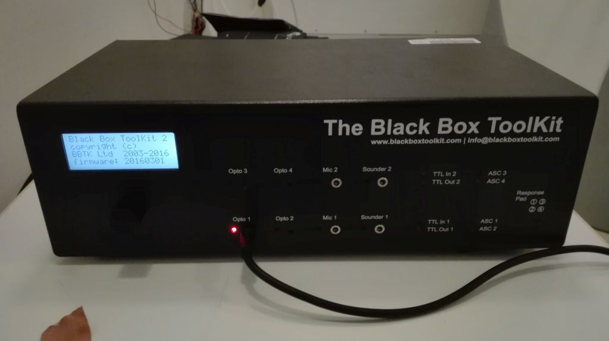

The Blackbox-Toolkit is a set of devices for capturing signal timings. It's main usage is for measuring time-delays between Trigger-Signals (= Event-Markers) and the actual appearance of stimulaton-sensations. It includes optical sensors (2 photodiodes for attaching to a screen) and an acoustic-sensor (small microphone for attaching to L or R of the pneumatic earphones by using an adhesive tape).

**Before starting with a new experiment, it is essential to do a blackbox-recording first!**

Hold on! Before blackbox testing it is a good idea to record the trigger (without participant in the MEG) to check the timing of the trigger itself. So, this basically means you run your experimental script in its final state. This allows you to make sure that all the triggers are available and that the timing of all the trigger is correct. At this state it is also a good idea to measure the timing between event trigger (e.g. to check the timing between a visual cue and a target, etc). In case your trial starts with a fixation cross / no event of interest for MEG analysis, make sure to send a trigger for trial onset to be able to measure the timing of trial onset and the event / signal (if required).

After this, the blackbox testing comes into play. This is necessary to make sure that - in the optimal case -  the trigger is presented at the time when the actual event, e.g. sound, occurs (with a constant delay of 16.5 ms in case of auditory stimuli due to the traveling time through the plastic tubes and in case you did not correct for it in your stimulation script). For the blackbox testing one should be aware (in advance) of what exactly one wants to measure: so, it is a good idea to write down all the events present in the stimulation (in case there are several events per trial). Then think about whether you want to measure the duration of each event (in case of a visual stimulus to make sure it is presented for the time you intended to present it).

One should be aware that for the blackbox testing that there are two photodiodes available. This might be advantageous in case you have two visual events in your stimulation. There is also a microphone to measure audio signals. For blackbox testing it is recommended to use only one trigger: 255 for all the different events.

Make sure to do the blackbox testing for at least 3 min.

**Important info from 2019/08/12: Make sure to run your experiment and the blackbox testing under windows and NOT under linux - at least when you use sounds as stimuli - as we discovered timing issues under linux (probaly because the current linux version is outdated and has old drivers).**

**1. Put Blackbox on small table inside MSR**

**2. Connect Power-Supply-Cable to Blackbox - plug it on Powersocket inside stimulation cabinett**

**3. Connect the Blackbox with your Laptop by using the USB-cable (please install BBTK-Software on your PC first (CD). Please stay with Laptop outside the MSR!**

**4. Connect Triggerbox with Blackbox. Plug BNC to "out 1" (or another "out-socket") on the triggerbox inside stimulation-cabinett (please adapt your script temporarely, so that all trigger-signals are coming out at implied "BNC-out-socket") and connect the other side (Electronic Board) to "TTL/ASC" on the rear side of the Blackbox.**

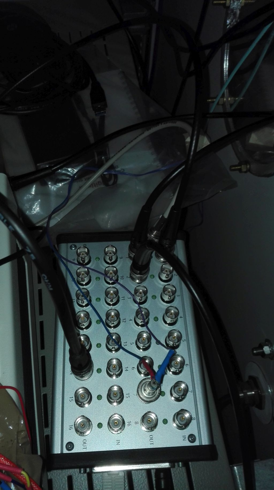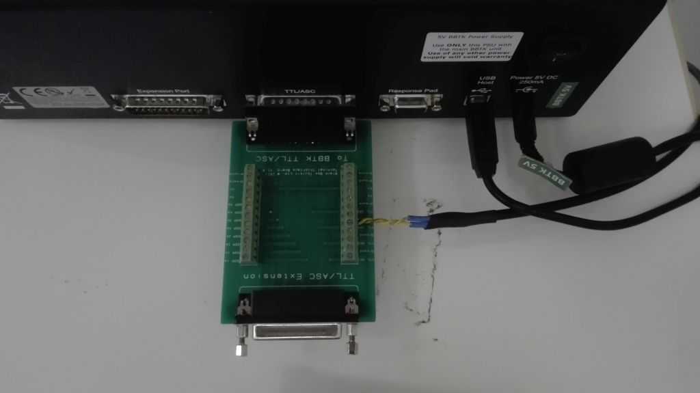

**5. Connect the sensors (Photodiode at Opto 1, 2, 3 or 4 / Microphone at Mic 1 or Mic 2)**

**6. Attach Photodiode to screen - place the fotodiode on appropriate location**

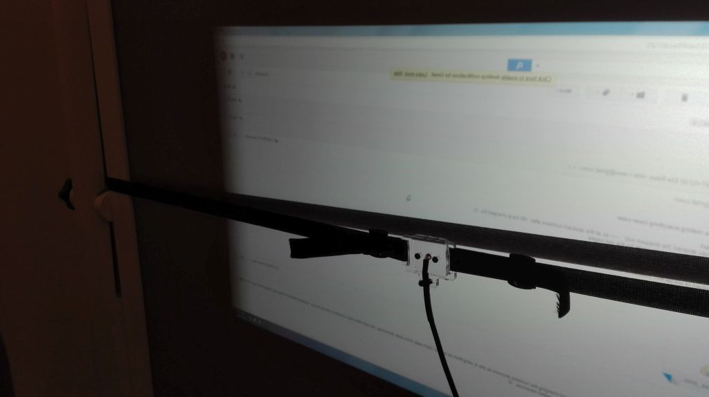

**7. If experiment includes an auditory task, attach Microphone to Headphone L or R by using an adhesive tape**

**8. Switch on Blackbox**

**9. Start BBTK-Software on your Laptop**

**10. Set sensor threshold(s)**

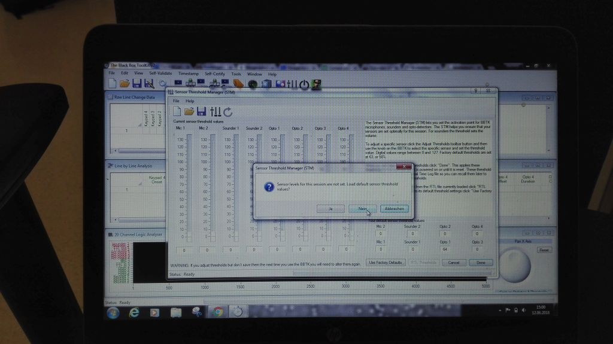

Answer default threshold - question with "no"

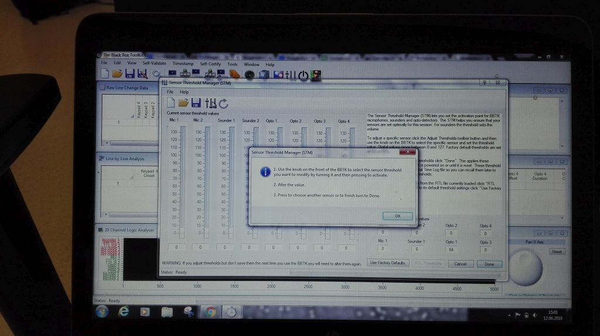

Click on controller-symbol on top and follow intstructions 1., 2., 3. Read and click OK first before going to the blackbox.

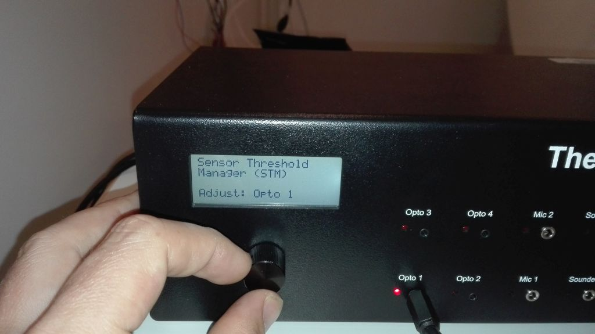

Select sensor by turning the knob and press knob when selected.

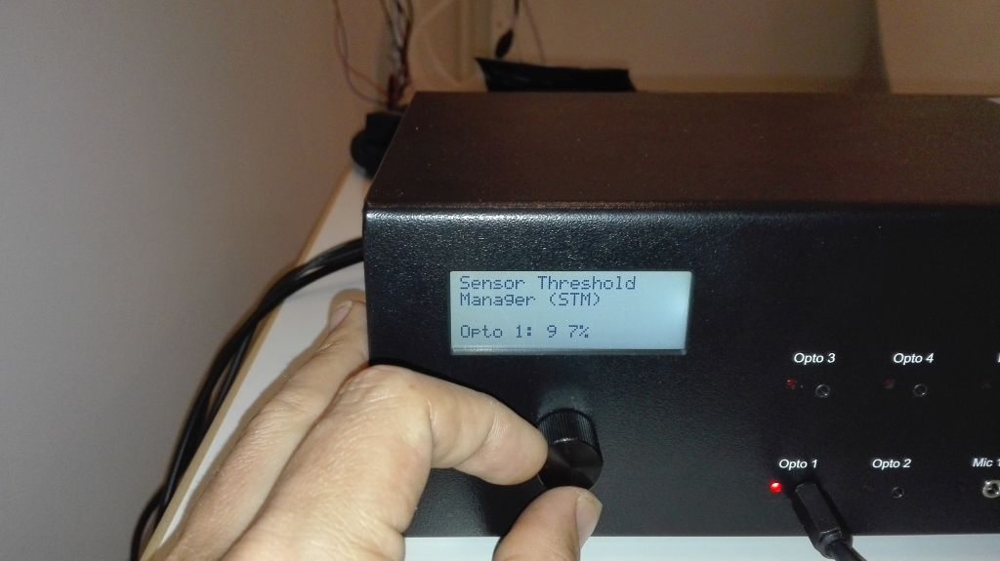

Set threshold: increase or lower percentage until red LED only flashes when appropriate visual- or acoustic event appears, then press knob again.

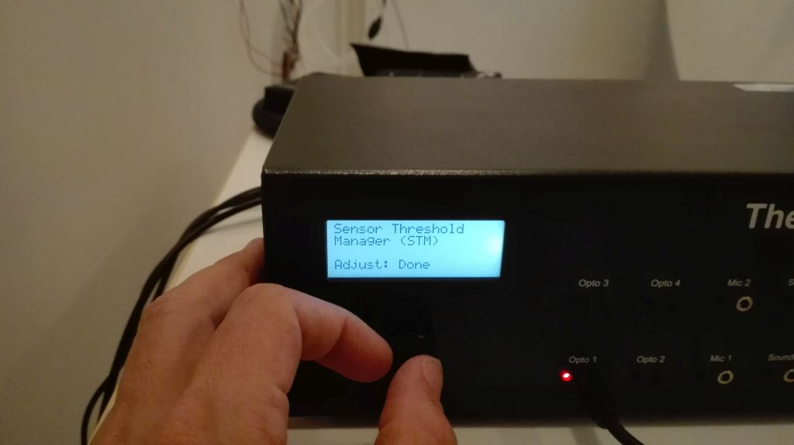

After that, turn knob again and select "Done". Press knob again.

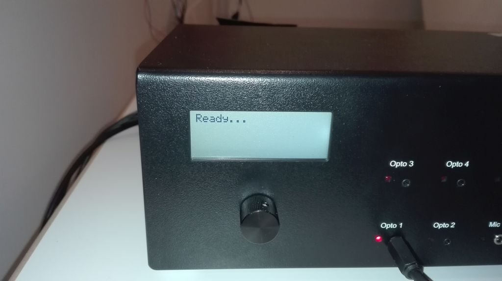

Display shows "Ready...". Now go to Laptop:

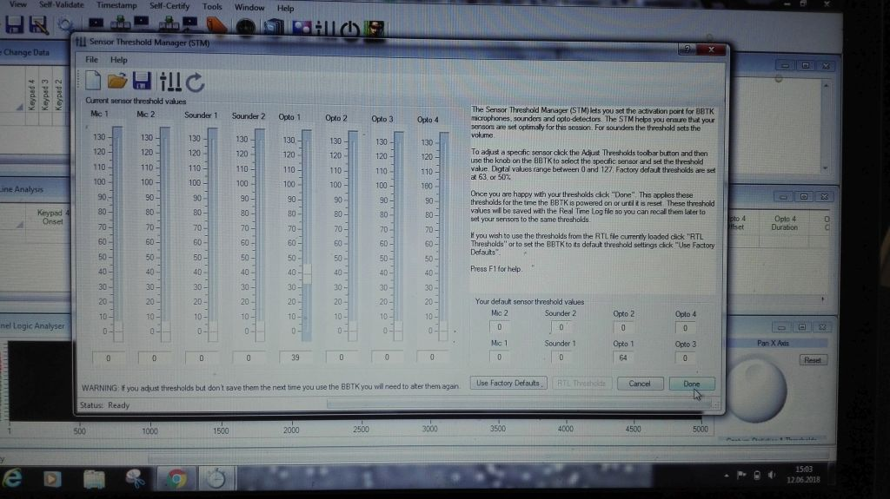

Click on "Done"

**11. Record signals**

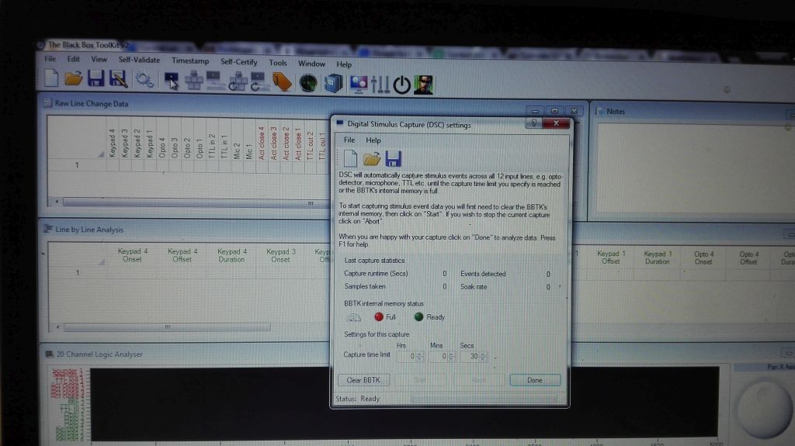

Click on Monitor-Symbol on top - DSC window appears. Click "Clear BBTK".

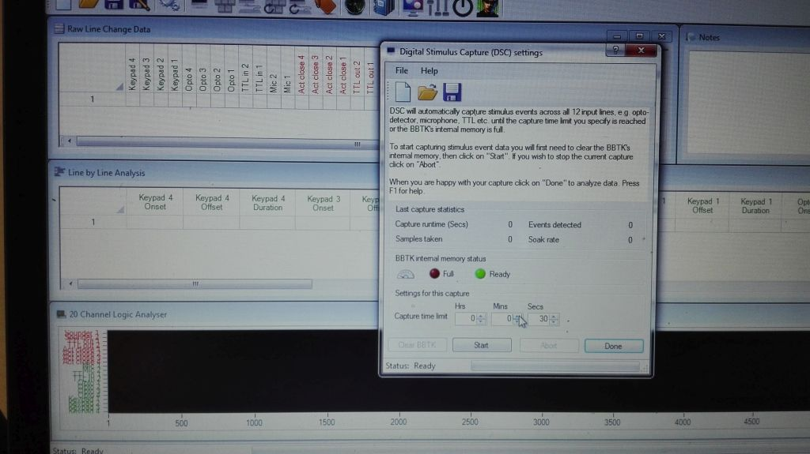

Now you can start recording. Set recording-time (e.g. 3min) and click "Start".

Now the signals are captured. It stops automatically when set time is over.

**12. Save data**

Click on the disk-symbol on the top left, and name the file (*.rtl).

To open this file, the BBTK-Software is needed, but there is also a way to export the data as a txt - file. you can also copy the measurement-values to an excel table e.g.
